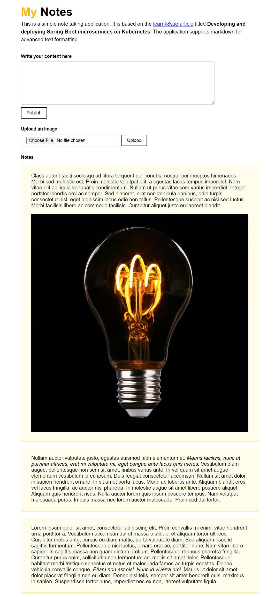

<h1 align="center">JOT IT DOWN</h1>

## Developing and deploying containerized Spring Boot Microservices on Kubernetes
-------------------------------------------
This is an implementation of the project discussed in the article on [learnk8s.io](https://learnk8s.io/spring-boot-kubernetes-guide) by Mauricio Salatino where a simple note taking application is created using Java Spring Boot framework, containerized using docker and deployed on a local Kubernetes cluster.

The application used Spring JPA with a MongoDB database and a Minio Object Store, all running as microservices on a kubernetes cluster. I have made some modifications in the source code and configuration parameters based on changes to the components used in the application.



## Getting Started
-------------------------------------------
Please setup an `application.properties` file in the `src/main/resources` directory with the following lines to get started -

```
spring.data.mongodb.host=host.docker.internal
spring.data.mongodb.port=27017
```

If you wish to try running this application on docker, you may pull the container from docker hub using `docker pull devanandkmenon/notes-app`. I have also placed the kubernetes configuration YAML files under `/kube` directory.

## Contributing
------------
This repository is intended for educational purposes and does not accept further contributions. Feel free to utilize and enhance the app based on your own requirements.

### Reference Documentation
------------
For further reference, please consider the following sections:

* [Official Apache Maven documentation](https://maven.apache.org/guides/index.html)
* [Spring Boot Maven Plugin Reference Guide](https://docs.spring.io/spring-boot/docs/3.1.1/maven-plugin/reference/html/)
* [Create an OCI image](https://docs.spring.io/spring-boot/docs/3.1.1/maven-plugin/reference/html/#build-image)
* [Spring Web](https://docs.spring.io/spring-boot/docs/3.1.1/reference/htmlsingle/#web)
* [Spring Boot Actuator](https://docs.spring.io/spring-boot/docs/3.1.1/reference/htmlsingle/#actuator)
* [Apache Freemarker](https://docs.spring.io/spring-boot/docs/3.1.1/reference/htmlsingle/#web.servlet.spring-mvc.template-engines)
* [Spring Data MongoDB](https://docs.spring.io/spring-boot/docs/3.1.1/reference/htmlsingle/#data.nosql.mongodb)

### Guides
The following guides illustrate how to use some features concretely:

* [Building a RESTful Web Service](https://spring.io/guides/gs/rest-service/)
* [Serving Web Content with Spring MVC](https://spring.io/guides/gs/serving-web-content/)
* [Building REST services with Spring](https://spring.io/guides/tutorials/rest/)
* [Building a RESTful Web Service with Spring Boot Actuator](https://spring.io/guides/gs/actuator-service/)
* [Accessing Data with MongoDB](https://spring.io/guides/gs/accessing-data-mongodb/)

